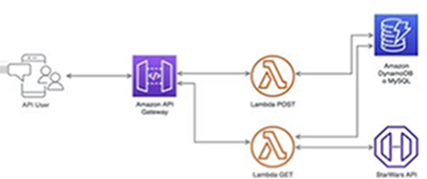

# SwApi Integration - Zoluxione

El siguiente proyecto realiza una integración entre [SWAPI](https://swapi.py4e.com/documentation#people) y DyanmoDB, donde se traduce los keys a español y realizando un GET y POST request para la consulta o ingreso de datos respectivamente, teniendo un flujo como el siguiente:





## Pre-requisitos

- Configurar credenciales en AWS

    ```
    aws configure
    ```
## Instalación
- Clonar el repositorio
- Usar version de nodejs del proyecto (ver `.nvmrc`)
    ```
    nvm use
    ```
- Instalar dependencias
    ```
    npm install
    ```

## Ejecutando en local

- Para hacer prueba de la app en local
    ```
    npm run local
    ```

## Test al servicio SWAPI

- Para hacer prueba de la app en local
    ```
    npm run test
    ```

## Despliegue

- Para hacer el deploy
    ```
    npm run deploy
    ```

## CI/CD
- El proyecto contiene un pipeline que automatiza el deploy cada vez que un commit es hecho a main branch. Considere ver `.github/workflows/deploy.yml` para más información.

## Arquitectura con

- NodeJS
- Serverless Framework
- Typescript
- Dynamoose

## Documentación

- Puede encontrar la documentación en SWAGGER ejecutando:
    ```
    npm run docs
    ```

## Autor

* **James Noria** - *Full development* - [jamesnoria](https://github.com/jamesnoria)

## Licencia

- Este proyecto está bajo la Licencia MIT - mira el archivo [LICENSE](LICENSE) para detalles.

## Consideraciones for debugging

- Evitar ingresar los mismos datos en cada POST request.
- Recuerda usar node14
